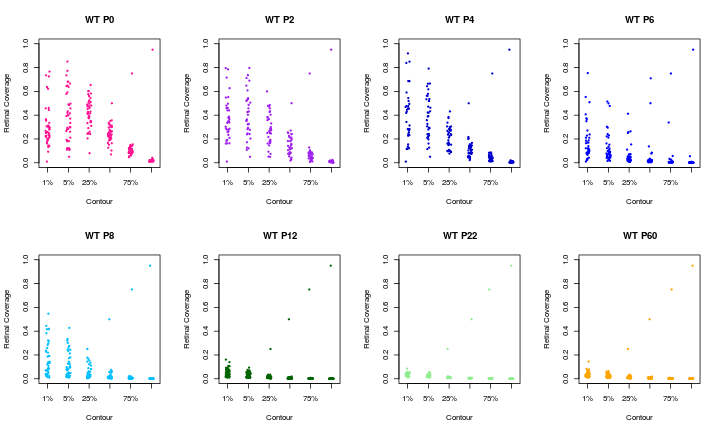

```r
require(knitr)
```

## Separation in retina data

The data regarding separation in retina (AP injections) is contained
in the two data files 
[data/NN-C57BL6J.csv](data/NN-C57BL6J.csv)
and
[data/NN-N2KO.csv](data/NN-N2KO.csv).


```r
nn_wt = read.csv("data/NN-C57BL6J.csv")
nn_b2 = read.csv("data/NN-B2KO.csv")
```

From here we can extract the number of animals (all biological
replicates) per age and per condition.  First the wild type: (first
row is age, second row is number of animals.  P16 was not considered
further.)


```r
table(nn_wt$Age)
```

```
## 
##  0  2  4  6  8 12 16 22 60 
## 13 18 15 21 31 18 11  9 22
```

Same table for the knockout.


```r
table(nn_b2$Age)
```

```
## 
##  0  2  4  6  8 12 22 60 
## 12  9  7 11 14  7  7 12
```


```r
wt_p0 = which(nn_wt$Age == 0)
wt_p2 = which(nn_wt$Age == 2)
wt_p4 = which(nn_wt$Age == 4)
wt_p6 = which(nn_wt$Age == 6)
wt_p8 = which(nn_wt$Age == 8)
wt_p12 = which(nn_wt$Age == 12)
wt_p22 = which(nn_wt$Age == 22)
wt_p60 = which(nn_wt$Age == 60)

b2_p0 = which(nn_b2$Age == 0)
b2_p2 = which(nn_b2$Age == 2)
b2_p4 = which(nn_b2$Age == 4)
b2_p6 = which(nn_b2$Age == 6)
b2_p8 = which(nn_b2$Age == 8)
b2_p12 = which(nn_b2$Age == 12)
b2_p22 = which(nn_b2$Age == 22)
b2_p60 = which(nn_b2$Age == 60)


p0_col = "DeepPink"
p2_col = "Purple"
p4_col = "MediumBlue"
p6_col = "blue"
p8_col = "DeepSkyBlue"
p12_col = "DarkGreen"
p22_col = "LightGreen"
p60_col = "orange"
```


```r
plot(nn_wt$Separation[wt_p0], nn_wt$NN.norm[wt_p0],
     pch=19, col=p0_col,
     xlab="Separation [um]", ylab="Segregation in retina",
     xlim=c(0,2000), ylim=c(0.4,1.0))
title("Figure 1E WT AP data")
points(nn_wt$Separation[wt_p60], nn_wt$NN.norm[wt_p60],
       pch=19,
       col=p60_col)
```


## Figure 3A


```r
plot(nn_wt$Separation[wt_p0], nn_wt$NN.norm[wt_p0],
     pch=19, col=p0_col,
     xlab="Separation [um]", ylab="Segregation in retina",
     xlim=c(0,2000), ylim=c(0.4,1.0))
title("Figure 3A WT AP data")

points(nn_wt$Separation[wt_p2], nn_wt$NN.norm[wt_p2],
       pch=19, col=p2_col)

points(nn_wt$Separation[wt_p4], nn_wt$NN.norm[wt_p4],
       pch=19, col=p4_col)

points(nn_wt$Separation[wt_p6], nn_wt$NN.norm[wt_p6],
       pch=19, col=p6_col)

points(nn_wt$Separation[wt_p8], nn_wt$NN.norm[wt_p8],
       pch=19, col=p8_col)

points(nn_wt$Separation[wt_p12], nn_wt$NN.norm[wt_p12],
       pch=19, col=p12_col)

points(nn_wt$Separation[wt_p22], nn_wt$NN.norm[wt_p22],
       pch=19, col=p22_col)

points(nn_wt$Separation[wt_p60], nn_wt$NN.norm[wt_p60],
       pch=19, col=p60_col)
title(sub="one data point below 0.4 missing in paper")
```


## Figure 5B - B2 P0 and Adult 


```r
plot(nn_b2$Separation[b2_p0], nn_b2$NN.norm[b2_p0],
     pch=19, col=p0_col,
     xlab="Separation [um]", ylab="Segregation in retina",
     xlim=c(0,2000), ylim=c(0.4,1.0))
title("Figure 5D B2 AP data")
points(nn_b2$Separation[b2_p60], nn_b2$NN.norm[b2_p60],
       pch=19, col=p60_col)
abline(h=0.4, lty=2)
title(sub="3 P0 datapoints missing from paper; under 0.4 line")
```


## Figure 6E - B2 P0 and Adult 


```r
plot(nn_b2$Separation[b2_p0], nn_b2$NN.norm[b2_p0],
     pch=19, col=p0_col,
     xlab="Separation [um]", ylab="Segregation in retina",
     xlim=c(0,2000), ylim=c(0.4,1.0))
title("Figure 6E B2 P0 P2 P4")
points(nn_b2$Separation[b2_p2], nn_b2$NN.norm[b2_p2],
       pch=19, col=p2_col)
points(nn_b2$Separation[b2_p4], nn_b2$NN.norm[b2_p4],
       pch=19, col=p4_col)
abline(h=0.4, lty=2)
title(sub="4 datapoints missing from paper; under 0.4 line")
```


```r
plot(nn_b2$Separation[b2_p6], nn_b2$NN.norm[b2_p6],
     pch=19, col=p6_col,
     xlab="Separation [um]", ylab="Segregation in retina",
     xlim=c(0,2000), ylim=c(0.4,1.0))
title("Figure 6F B2 P6 P8")
points(nn_b2$Separation[b2_p8], nn_b2$NN.norm[b2_p8],
       pch=19,
       col=p8_col)
abline(h=0.4, lty=2)
```


```r
plot(nn_b2$Separation[b2_p12], nn_b2$NN.norm[b2_p12],
     pch=19, col=p12_col,
     xlab="Separation [um]", ylab="Segregation in retina",
     xlim=c(0,2000), ylim=c(0.4,1.0))
title("Figure 6G B2 P12 P22 P60")
points(nn_b2$Separation[b2_p22], nn_b2$NN.norm[b2_p22],
       pch=19,
       col=p22_col)
points(nn_b2$Separation[b2_p60], nn_b2$NN.norm[b2_p60],
       pch=19, col=p60_col)
abline(h=0.4, lty=2)
```


<!-- knit("methods.Rmd") -->

## Convergence data


Convergence data are stored in
[data/CONTOUR-WT.xlsx](data/CONTOUR-WT.xlsx) and
[data/CONTOUR-B2.xlsx](data/CONTOUR-B2.xlsx).


Set up to read the data:

```r
library(readxl)
library(dplyr)
get_data = function(dat) {
  f = function(x) {
    x = as.numeric(x)
    valid = is.finite(x)
    x[valid]
  }
  j = dat %>% pull(10) %>% f
  k = dat %>% pull(11) %>% f
  l = dat %>% pull(12) %>% f
  m = dat %>% pull(13) %>% f
  n = dat %>% pull(14) %>% f
  o = dat %>% pull(15) %>% f
  
  res = list("1%"=j, "5%"=k, "25%"=l, "50%"=m, "75%"=n, "95%"=o)

  res
}

cont_wt_p0 = read_excel("data/CONTOUR-WT.xlsx",col_names = FALSE,sheet="P0")

ages = c("P0", "P2", "P4", "P6", "P8", "P12", "P22", "P60")

colors = c(
  P0 = "DeepPink",
  P2 = "Purple",
  P4 = "MediumBlue",
  P6 = "blue",
  P8 = "DeepSkyBlue",
  P12 = "DarkGreen",
  P22 = "LightGreen",
  P60 = "orange")

show_phenotype <- function(cond) {
  par(mfrow=c(2,4))
  file = sprintf("data/CONTOUR-%s.xlsx", cond)
  for (age in ages) {
    cont_wt = read_excel(file,col_names = FALSE,
                         sheet=age)
    l = get_data(cont_wt)
    stripchart(l, method="jitter",vertical=TRUE, pch=20,
               ylim=c(0,1),
               xlab="Contour", ylab="Retinal Coverage",
               col=colors[age],
               main=paste(cond, age))
  }
}
```

### Raw data for wild type


```r
show_phenotype("WT")
```



### Raw data for knockout


```r
show_phenotype("B2KO")
```


